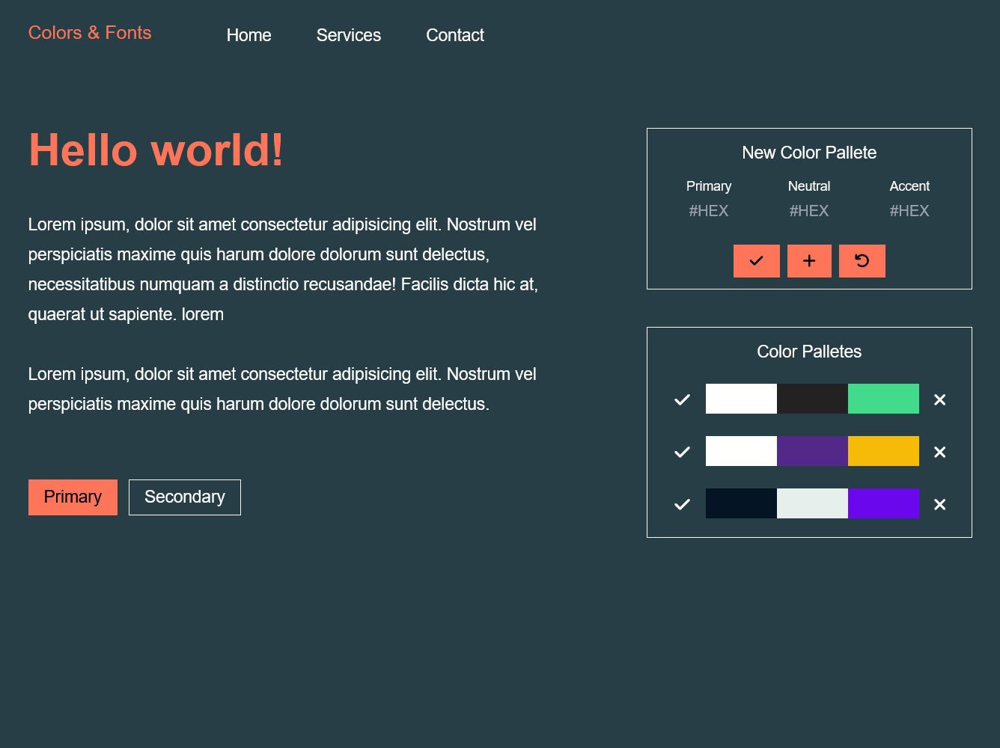

# Colors Check

## Description

An app to test the color combination balance in the common webpage



## Features

- Insert a custom color pallete and set it as a web color theme
- Add custom color pallete into pallete collection
- Apply and delete the pallete collection

## Project Deployment

https://colors-check.vercel.app/

## How to Run in Local Computer

1. Install all the modules

```
npm install
```

2. Compiles and hot-reloads for development

```
npm run serve
```

3. Compiles and minifies for production

```
npm run build
```

4. Lints and fixes files

```
npm run lint
```

5. Customize configuration
   See [Configuration Reference](https://cli.vuejs.org/config/).

## Technologies

- Vue.js
- Tailwind CSS
